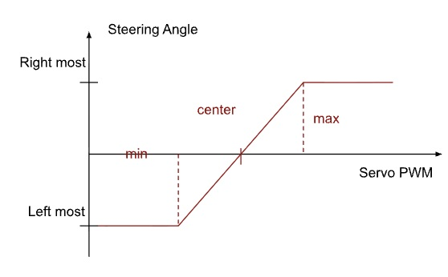
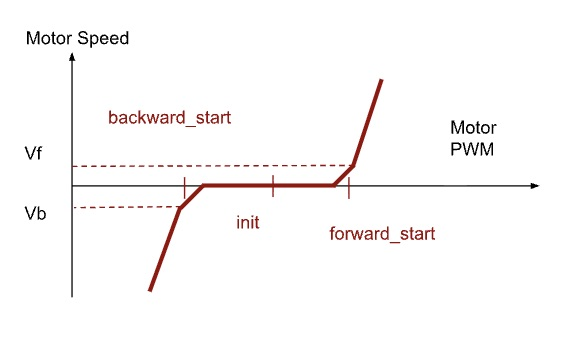
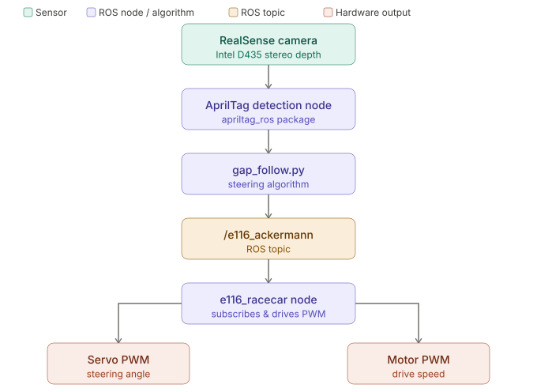

# Documenting our journey with E116 by Lehigh University

## TL;DR

This document evaluates the Lehigh E116 platform, in the effort of developing RoboRacer-mini, a hardware + software platform to use autonomous racing as a tool for high school and undergraduate students to explore physical AI. It walks through the course hardware and software week by week.

Most of the four weeks focus on getting the hardware working: batteries, SSH, PWM tuning, ROS workspaces, and camera and AprilTag setup. There is little time on software theory or racing. Autonomous driving appears mainly in Week 4 with gap follow. Most code is already provided. Students launch it on the car, tune a few parameters, and watch how it drives.

**Key videos**

[](https://youtu.be/1DGavq1OEdM)

*E116 hardware walkthrough*

[](https://youtu.be/t0ZZ9GUBdJ0)

*Follow the Gap algorithm*

## Table of Contents

1. [Week 1 — Hardware Familiarization &amp; Linux Basics](#week-1)
2. [Week 2 — Teleop, PWM Tuning &amp; ROS 2 Introduction](#week-2)
3. [Week 3 — RealSense Camera &amp; AprilTag Detection](#week-3)
4. [Week 4 — Gap Follow Algorithm](#week-4)
5. [References](#references)

---

## Week 1 — Hardware Familiarization & Linux Basics

Covered the E116 car hardware, batteries, motor/ESC, and basic Ubuntu on the Jetson Orin Nano.

### Key Concepts

#### 1.1 Battery Chemistry

| Battery        | Chemistry | Nominal | Use              |
| -------------- | --------- | ------- | ---------------- |
| LiPo (OVONIC)  | 3S LiPo   | 11.1 V  | Jetson / compute |
| NiMH (Traxxas) | 6-cell    | 7.2 V   | ESC / drivetrain |

LiPo max discharge current: $I_{max} = C \times \text{Capacity (Ah)}$ (e.g. 50C × 1.4 Ah ≈ 70 A).

The onboard checker beeps is LiPo hits near 3.5 V. For desk work the LiPo can be swapped for a barrel jack so the battery doesn't drain and the Jetson keeps getting power.

[](https://www.youtube.com/shorts/BVJqiAOtouw)

*Charging the Traxxas NiMH drive battery*

[](https://www.youtube.com/shorts/CKEU-UIINII)

*Charging the Ovonic 3S LiPo used to power the Jetson*

#### 1.2 Motor & ESC

The E116 uses a Velineon 380 brushless motor paired with an Electronic Speed Controller (ESC). The ESC drives the motor by switching the phase currents electronically using PWM.

---

#### 1.3 GPU vs. CPU and the NVIDIA Jetson Orin Nano

|            | CPU                    | GPU                           |
| ---------- | ---------------------- | ----------------------------- |
| Core count | Few (high clock speed) | Thousands (lower clock speed) |
| Best for   | Serial, branchy logic  | Parallel numerical workloads  |
| On Jetson  | ARM Cortex-A78AE       | Ampere GPU (1024 CUDA cores)  |

The **NVIDIA Jetson Orin Nano** is designed for edge AI inference combining CPU, GPU, and memory in a low-power package suitable for an autonomous vehicle.

---

#### 1.4 Ubuntu Linux Basics

Key commands learned in the terminal:

```bash
ls -al               # list files with permissions
cd folder / cd ..    # navigate directories
mkdir new_folder     # create directory
cp file1 file2       # copy file
mv src dst           # move/rename
rm -r folder         # remove recursively
chmod a+x file.py    # make executable
grep pattern file    # search text
python3 script.py    # run Python script
```

### Video

[](https://youtu.be/1DGavq1OEdM)

*E116 hardware walkthrough: Jetson, carrier board, RealSense, batteries, and Traxxas chassis*

### Week 1 — Problems Encountered

LiPo charge settings (voltage/current) were unclear at first. The Traxxas pack had no simple way to see state of charge, and multimeter readings were unreliable. A Traxxas charger with a built-in display was used instead.

## Week 2 — Teleop, PWM Tuning & ROS 2 Introduction

Implementing keyboard teleop, PWM tuning for servo and ESC, and an intro to ROS 2 Humble.

### Key Concepts

#### 2.1 PWM tuning

E116 PWM runs at 200 Hz. Duty cycle is set as a percentage; each step is about 0.39% ($100\%/256$).

Motors were tuned using custom scripts for testing various PWM values for servo and throttle. 

Tuned values were saved in `e116.yaml`:

| Parameter              | Typical range   |
| ---------------------- | --------------- |
| `motor_forward_start`  | 30.00 – 31.50 % |
| `motor_backward_start` | 27.50 – 29.00 % |
| `servo_center`         | ~29.70 %        |

<table>
  <tr>
    <td></td>
    <td></td>
  </tr>
</table>

#### 2.2 SSH

SSH enables remote control of the Jetson without needing it to be plugged into a display and keyboard. 

```bash
ssh -X username@ipaddress
```

`-X` forwards X11 so GUI apps can open on the laptop. Commands run on the Jetson.

#### 2.3 ROS 2 basics

ROS provides a convenient way of exploring tbe core concepts using turtlesim. 

```bash
ros2 node list
ros2 topic list
ros2 topic echo /turtle1/cmd_vel
ros2 topic pub /turtle1/cmd_vel geometry_msgs/msg/Twist \
  "{linear: {x: 2.0, y: 0.0, z: 0.0}, angular: {x: 0.0, y: 0.0, z: 1.8}}"
ros2 run rqt_graph rqt_graph
```

### Video

[](https://www.youtube.com/watch?v=pdj6RnFm17U)

*Keyboard teleop driving the car over ROS 2*

### Week 2 — Problems Encountered

The drive battery died quickly during PWM tuning. Full charge (12.6 V on the 3S LiPo) was needed. At 12.3 V runtime was already too short to finish a session. The provided PWM scripts did not work as intended, so we wrote custom scripts. 

Moreover, X11 forwarding did not show the pygame teleop window. A terminal teleop node (WASD over ROS) was written instead to make teleop work. 

---

## Week 3 — RealSense & AprilTags

### Overview

Set up the Intel RealSense D435i on ROS 2, built a workspace with `apriltag_ros`, and moved teleop into launch files.

### Key Concepts

#### 3.1 ROS 2 Workspace and Package Structure

```
team_ws/
├── src/
│   ├── e116/
│   │   ├── e116/
│   │   ├── launch/
│   │   └── config/
│   ├── apriltag/
│   ├── apriltag_ros/
│   └── apriltag_msgs/
├── build/
├── install/
└── log/
```

To build the ROS workspace and run custom nodes or launch files:

```bash
cd ~/team_ws
colcon build
source install/setup.bash
```

#### 3.2 AprilTags

Tag family used was tag36h11. Each tag has an ID; `apriltag_ros` publishes pose in the camera frame.


#### 3.3 RViz

Tag detections show up as TF frames in RViz.

[](https://youtu.be/-wQYCcO4qdc)

*AprilTag detections shown as TF frames in RViz while tags move in front of the camera*

#### 3.4 Ackermann topic

Teleop and planners publish `ackermann_msgs/AckermannDriveStamped` on `/e116_ackermann`:

```
ackermann_msgs/AckermannDriveStamped
  drive:
    steering_angle: <radians>
    speed: <m/s>
```

`e116_racecar` subscribes and converts to servo/ESC PWM.

### Week 3 — Problems Encountered

No problems from Week 3 content.

---

## Week 4 — Gap Follow & Race Prep

### Overview

Ran autonomous gap follow with AprilTags on the left wall (IDs 100–199) and right wall (200+) definining a corridor and the car steering toward the midpoint.

### Key Concepts

#### 4.1 Gap follow (`gap_follow.py`)

1. Read tag poses from `/tf`
2. Pick one left tag (ID ≤ 199) and one right tag (ID ≥ 200)
3. Steer toward the midpoint in the camera frame
4. Publish `AckermannDriveStamped` on `/e116_ackermann`

Main tunables were `SPEED1`, `SPEED2`, `angle_scale`, `SINGLE_TAG_OFFSET`, `t_keep1`, `t_keep2`.



#### 4.2 Headless track workflow

1. SSH to Jetson
2. Launch camera, apriltag, gap_follow, racecar nodes
3. Unplug from wall socket and connect LiPo + NiMH
4. Set car on track

#### 4.3 Track layout

```
100-series (left)          200-series (right)
|                                |
|              ↑ path            |
|                                |
```

### Video

[](https://youtu.be/t0ZZ9GUBdJ0)

*Autonomous navigation using Follow the Gap algorithm*

### Week 4 — Problems Encountered

With one tag visible, the stock controller used a fixed `turningAngle` and the car jerked sideways. That was replaced with steering toward an offset goal (`SINGLE_TAG_OFFSET`) when only one wall tag is seen.

Parameter tuning over SSH was awkward. Foxglove helped view the camera and tag frames, but tags sometimes stayed on screen after they left the field of view, which made it harder to match tuning to what the camera still saw.

Battery life was still short (same as Week 2). Both packs were charged before track time; LiPo was swapped on AC power to avoid rebooting the Jetson.

---

## References

1. [ROS 2 Humble](https://docs.ros.org/en/humble/)
2. [Intel RealSense D435](https://store.realsenseai.com)
3. [AprilTag library](https://github.com/AprilRobotics/apriltag)
4. [apriltag_ros](https://github.com/christianrauch/apriltag_ros)
5. [Traxxas 1/16 E-Revo VXL](https://traxxas.com/71076-8-116-e-revo-vxl-wbattery)
6. [Jetson Orin Nano](https://www.nvidia.com/en-us/autonomous-machines/embedded-systems/jetson-orin/)
7. [Ubuntu command line](https://ubuntu.com/tutorials/command-line-for-beginners)
8. [F1TENTH gap follow lab](https://f1tenth-coursekit.readthedocs.io/en/stable/assignments/labs/lab4.html)

---

### Acknowledgements

Thanks to Professor Rosa Zheng for the E116 platform, carrier board, and lab materials this journal is based on.

---

*Compiled from ECE lab weeks 1–4. Hardware and parameters match the Lehigh E116 car.*

---

### Evaluation for RoboRacer-mini

Notes below come from running the E116 stack and thinking about what to keep or change.

- ROS 2: Despite the benefits of huge community support and usage of ROS 2, the overheads are also real. It is difficult for students to be acquainted with launch files, `tf`, multiple terminals, and SSH-only operation that early on. RoboRacer-mini could use a more GUI-friendly tool for coding and controlling the car, and ROS may be under the hood.

- Traxxas 1/16 E-Revo VXL: Traxxas quotes ~1.09 kg for the roller alone. With Jetson, carrier, RealSense, extra LiPo, and brackets, the suspension arms and plastic parts flex noticeably, and that affects drive performance and durability. And it could lead to very quick structural damage. 

- Jetson Orin Nano: Weeks 1–4 did not need the GPU; AprilTag gap follow ran on CPU via `apriltag_ros`. Students still manage JetPack Linux, two power sources, WiFi + SSH, GPIO/PWM on the custom carrier, and slow rebuilds on the board. Jetson makes sense for later vision/ML modules; smaller classes might share a few boards or use lighter compute for the first half of the course.

- BOM: Roughly $1,200–1,600 per car if you price Jetson (~$249), Traxxas (~$300), D435i (~$350–450), LiPo/charger, E116 power board, and track/tags/spares.

- E116 gap follow: This is AprilTag corridor following (midpoint between 100-series and 200-series tags), not the [F1TENTH follow-the-gap lab](https://f1tenth-coursekit.readthedocs.io/en/stable/assignments/labs/lab4.html) on lidar or a depth scan. It is a reasonable first closed-loop autonomy assignment on a marked course. The RealSense depth stream is barely used. Single-tag cases needed code changes. Autonomous speeds in practice were much lower than the template defaults (on the order of 0.1–0.15 m/s vs 0.75–1.2 m/s). Worth keeping as an early module, but should follow with real depth-based gap follow so the name matches what students read elsewhere.